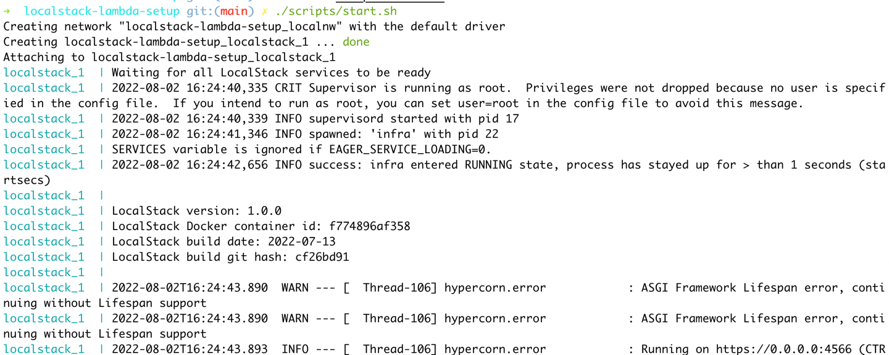
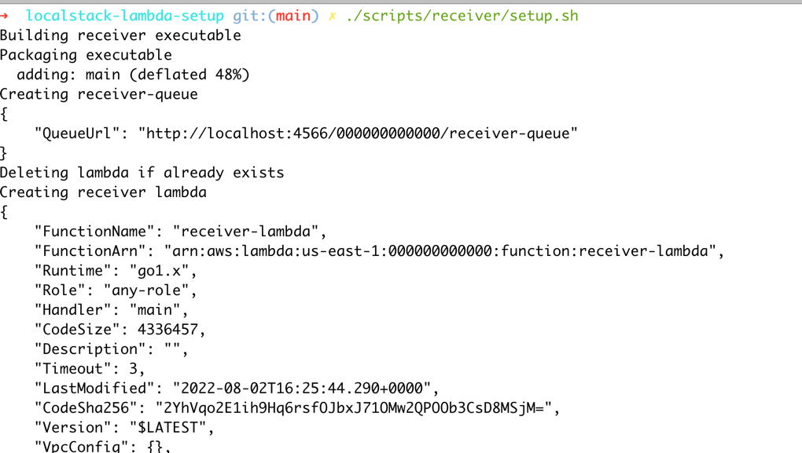

# localstack-lambda-setup
Example code to show how to test aws lambda locally such as how to invoke lambda and how to trigger lambda asynchronously using sqs event locally.

### Commands
1. Start localstack container
```shell
./scripts/start.sh
```

2. Setup queue and lambda 
```shell
./scripts/receiver/setup.sh
```

3. Push message to queue in order to trigger lambda
```shell
./scripts/receiver/send_msg.sh
```

### Sample



